Name    : Arya Raditya Kusuma

NPM     : 2306215816

Class    : B

# Weekly Assignment 5

## Test Results

### /highest-gpa - before optimization

#### 1. View Results Tree

#### 2. View Results Table

#### 3. Summary Report
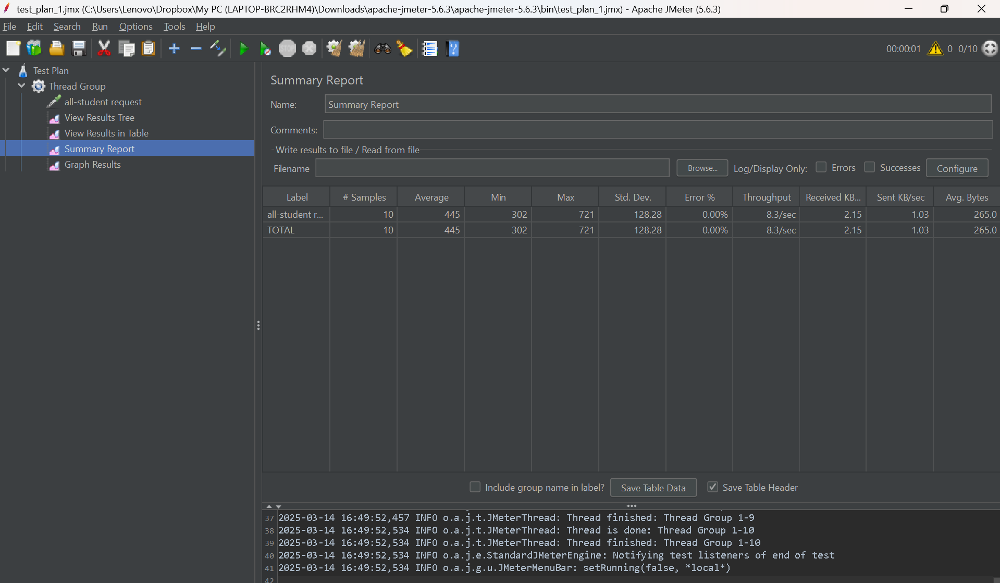
#### 4. Graph Results
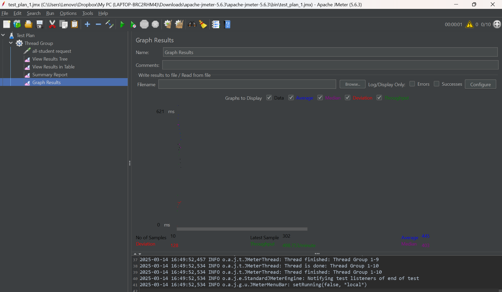
#### 5. Via CLI
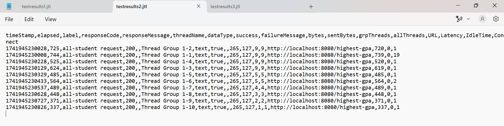

### /all-student-name - before optimization

#### 1. View Results Tree
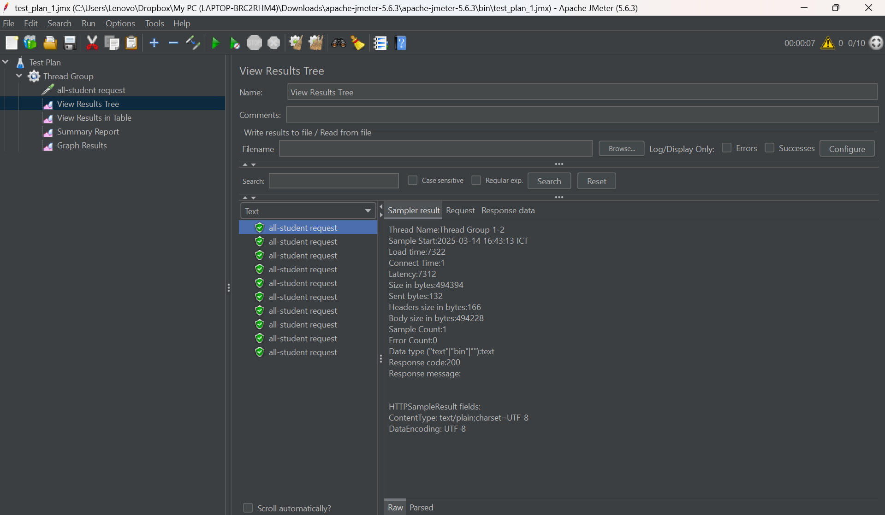
#### 2. View Results Table
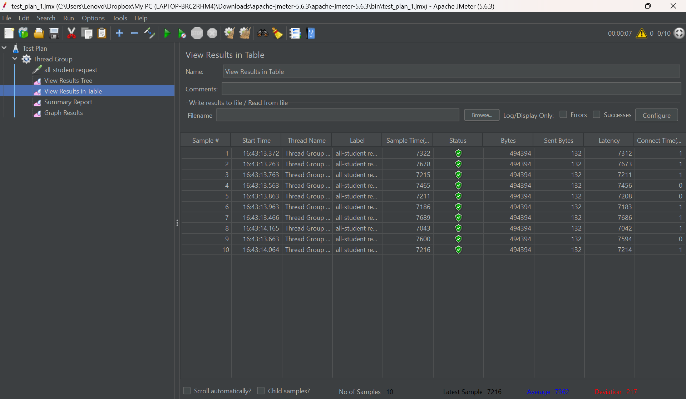
#### 3. Summary Report
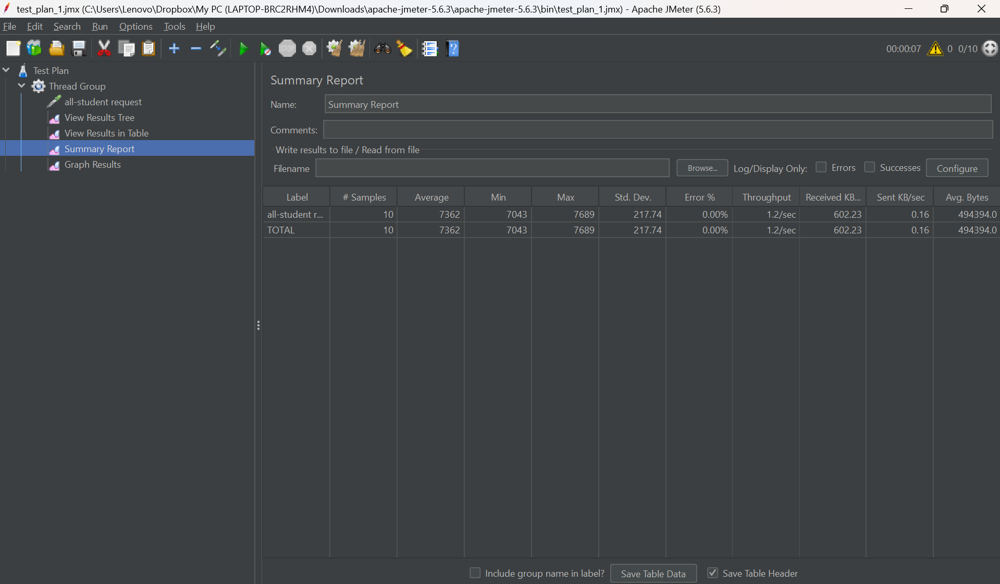
#### 4. Graph Results
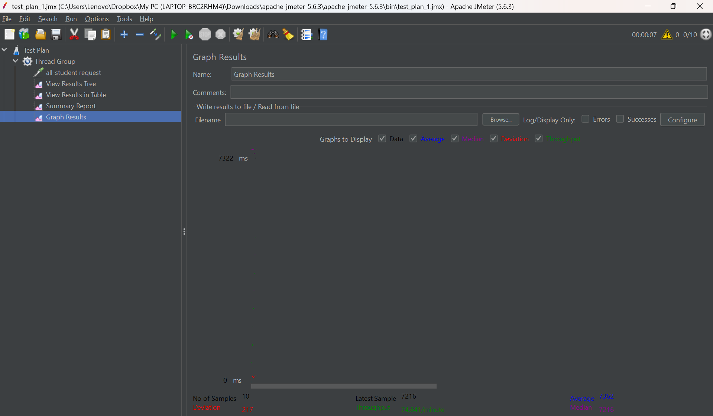
#### 5. Via CLI
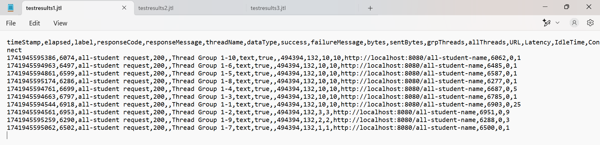

### /highest-gpa - after optimization

#### 1. View Results Tree
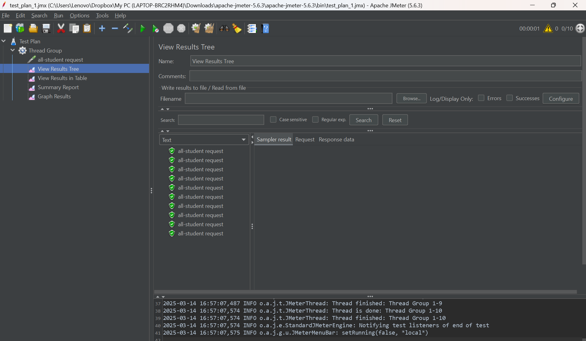
#### 2. View Results Table
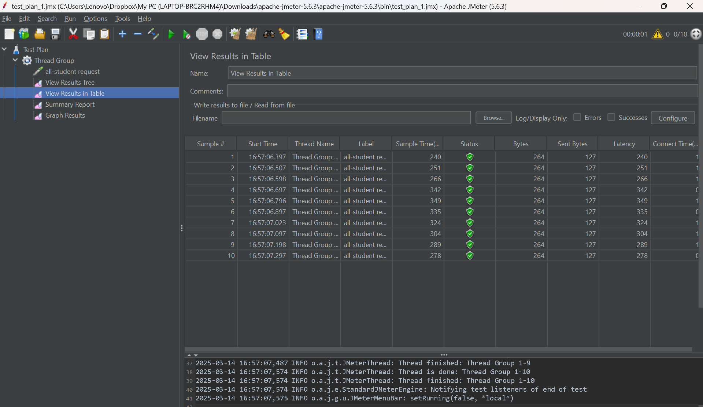
#### 3. Summary Report

#### 4. Graph Results

#### 5. Via CLI
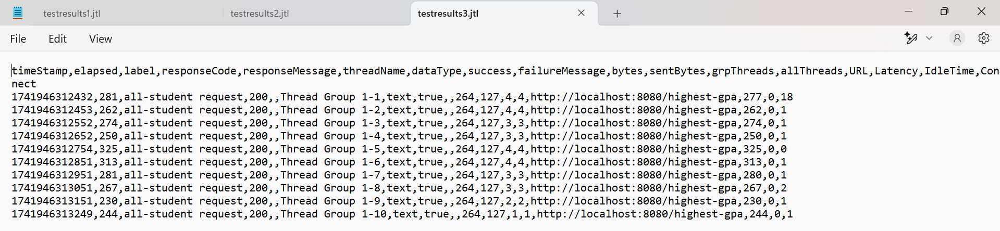

### /all-student-name - after optimization

#### 1. View Results Tree
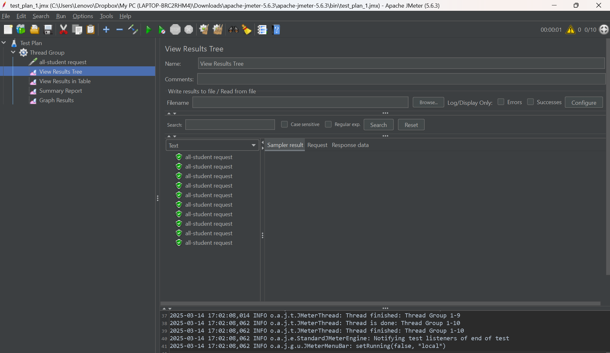
#### 2. View Results Table
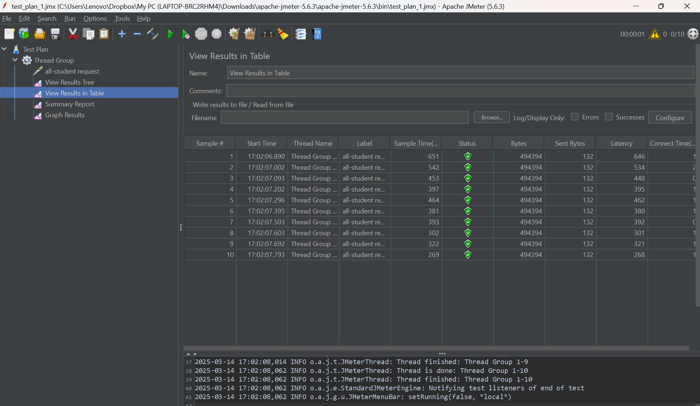
#### 3. Summary Report
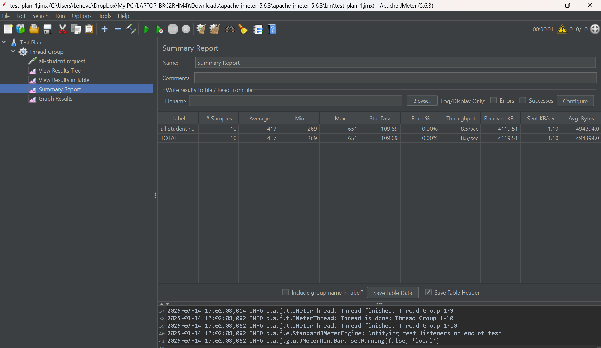
#### 4. Graph Results
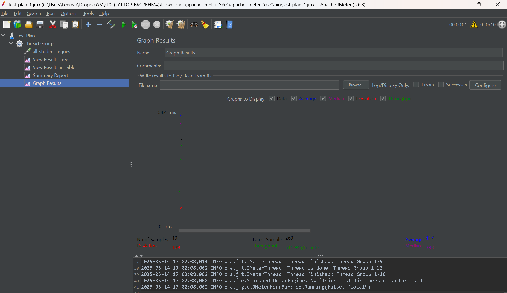
#### 5. Via CLI
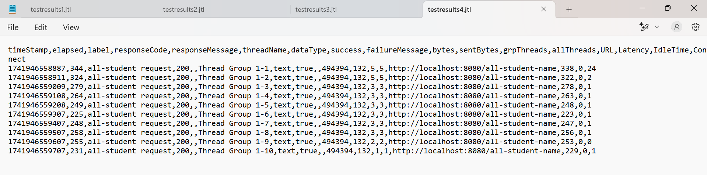

### Test Conclusion

After profiling the application with IntelliJ Profiler and implementing optimizations, particularly within the StudentService class, a follow-up performance test was conducted using JMeter. The results demonstrate a significant overall improvement in application performance.

The optimizations applied, guided by the profiling data, were effective in addressing identified bottlenecks.  While the degree of improvement varied across different operations, the JMeter re-test confirmed a positive impact from the changes made.  This indicates that the targeted approach, focusing on areas identified as inefficient by the profiler, was successful.

Overall, the profiling and optimization process successfully improved the application's performance. The use of IntelliJ Profiler facilitated the identification of performance bottlenecks within the StudentService, and the subsequent optimizations, validated by JMeter testing, demonstrate the value of a data-driven approach to performance tuning. 

## Reflection

> What is the difference between the approach of performance testing with JMeter and profiling with IntelliJ Profiler in the context of optimizing application performance?

Performance testing with JMeter and profiling with IntelliJ Profiler offer distinct, yet complementary, perspectives on application optimization. JMeter simulates real-world user behavior, sending requests to the application's endpoints and measuring response times, throughput, and error rates under different load conditions. This "black-box" approach assesses the application's external performance from an end-user's perspective, identifying whether the system can handle expected traffic levels. IntelliJ Profiler, in contrast, takes a "white-box" approach, diving deep into the application's internal workings. It monitors CPU usage, memory allocation, method call counts, and execution times, pinpointing the specific lines of code or algorithms responsible for performance bottlenecks. In essence, JMeter reveals if there's a performance problem, while the IntelliJ Profiler helps determine why and where the problem exists within the codebase. Both combined form a powerful and complete understanding of an application.

> How does the profiling process help you in identifying and understanding the weak points in your application?

Profiling acts like a magnifying glass for your application's runtime behavior, exposing inefficiencies that are otherwise difficult to detect. By monitoring resource consumption at a granular level (method calls, memory allocation, thread activity), the profiler highlights areas where the code spends excessive time or uses excessive resources. For example, a profiling session might reveal that a particular database query is executed repeatedly within a loop, or that an algorithm is using an inefficient data structure, consuming a large chunk of the processing time. This detailed information allows developers to shift from making educated guesses about bottlenecks to making data-driven decisions, targeting specific code segments for optimization. Without a profiler, performance tuning often involves trial and error; with a profiler, it's a precise and targeted process. This leads to more substantial and appropriate fixes.

> Do you think IntelliJ Profiler is effective in assisting you to analyze and identify bottlenecks in your application code?

Yes, I find IntelliJ Profiler to be a highly effective tool for identifying bottlenecks in my application code. Its visual representations, such as flame graphs and call trees, make it easy to grasp the flow of execution and pinpoint the "hotspots" where the program spends most of its time. The ability to drill down from high-level overviews to individual method calls and even lines of code provides a level of detail that is invaluable for performance analysis. Features like CPU profiling, memory profiling, and thread analysis provide a comprehensive view of resource usage. The integration within the IntelliJ IDE also streamlines the process, allowing for rapid iteration between profiling, code modification, and re-profiling, making it easy to experiment and verify optimizations. I find the overall integration very helpful.

> What are the main challenges you face when conducting performance testing and profiling, and how do you overcome these challenges?

One significant challenge is interpreting the often overwhelming amount of data generated by profilers. It can be difficult to sift through the various metrics and visualizations to identify the true root causes of performance issues. To address this, I've learned to focus on the key performance indicators (e.g., highest CPU time, largest memory allocations) and use the profiler's filtering and sorting capabilities to narrow down the scope. Another challenge is reproducing realistic usage scenarios during profiling; the overhead of profiling itself can sometimes alter the application's behavior. To minimize this, I try to keep profiling sessions short and focused, and I avoid profiling in environments with limited resources. Finally, ensuring that profiling results are reproducible and not influenced by external factors (like network latency or other processes) requires careful control of the testing environment. The set up of the environment takes great attention.

> What are the main benefits you gain from using IntelliJ Profiler for profiling your application code?

The primary benefit is the ability to move from guessing about performance bottlenecks to knowing exactly where they are. This allows for targeted and effective optimization efforts, saving significant development time and effort. The profiler's detailed reports provide concrete evidence to justify code changes, making it easier to collaborate with team members and explain optimization decisions. Another major benefit is the increased understanding of the application's runtime behavior. Seeing how the code executes in detail, including memory allocations and thread interactions, leads to a deeper appreciation of the underlying mechanisms and potential pitfalls. The insights will greatly improve my future work.

> How do you handle situations where the results from profiling with IntelliJ Profiler are not entirely consistent with findings from performance testing using JMeter?

Such discrepancies are not uncommon and often point to factors beyond the code itself. When JMeter and IntelliJ Profiler show different results, I start by investigating the testing environments. Differences in hardware, network configurations, database load, or even the presence of other running processes can influence performance measurements. I would also examine the JMeter test plan to ensure it accurately reflects real-world usage patterns; an unrealistic test scenario might not trigger the same bottlenecks identified by the profiler. If discrepancies persist, I might consider using additional profiling tools or techniques (e.g., tracing, logging) to gather more data and corroborate findings. Ultimately, the goal is to reconcile the "external" view (JMeter) with the "internal" view (IntelliJ Profiler) to get a complete picture of the performance landscape. These extra steps will usually reveal the problem.

> What strategies do you implement in optimizing application code after analyzing results from performance testing and profiling? How do you ensure the changes you make do not affect the application's functionality?

After identifying performance bottlenecks through testing and profiling, my optimization strategy focuses on achieving the greatest performance gains with the least risk. I prioritize changes that address the most significant bottlenecks identified by the profiler (e.g., optimizing a frequently called method that consumes a large percentage of CPU time). Common optimization techniques include improving algorithm efficiency (e.g., switching from a linear search to a binary search), reducing database calls (e.g., caching frequently accessed data), and optimizing memory usage (e.g., avoiding unnecessary object creation). To ensure that changes don't break existing functionality, I rely heavily on unit and integration tests. Before making any significant changes, I ensure that I have a robust test suite that covers the relevant code paths. After making the changes, I rerun the tests to verify that no regressions have been introduced. This iterative process of profiling, optimizing, and testing continues until the desired performance goals are met, and the code remains functionally correct. Using version control and code reviews also helps to maintain the safety of the project.
